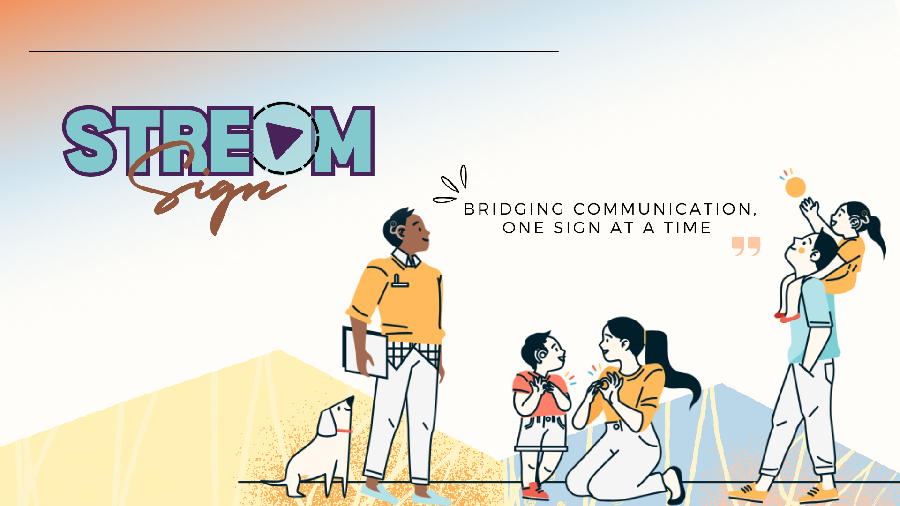

# Stream-Sign
Project idea: Video to Sign Language Animations
</break>

- 10 out of 2000 U.S. High School students from TRAIN(AI-ML) course of the Coding School were selected through applications. 
- Following the track of independent research, I built an AI application called StreamSign that translates videos to Indian Sign Language animations, to help bridge accessibility for the deaf social media users. The app uses flask, python, Google Text to speech API and custom text NLP pre-processing algorithm.

Here is the link to the [final presentation](https://www.canva.com/design/DAGL4IV-csk/DO2ZUq26InEirelelUaSjg/view?utm_content=DAGL4IV-csk&utm_campaign=designshare&utm_medium=link2&utm_source=uniquelinks&utlId=hb666db044e)
